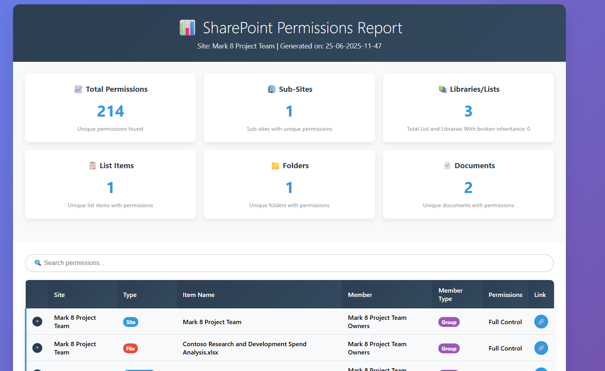

# SharePoint Unique Permissions Audit Tool



## 🎉 Welcome & Thank You!

Thank you for your interest in the **SharePoint Unique Permissions Audit Tool**! This project was developed to help SharePoint administrators efficiently audit and manage permissions across their environments. We're excited to have you here and welcome any contributions to make this tool even better.

## 📋 Table of Contents

- [🎉 Welcome & Thank You!](#-welcome--thank-you)
- [🔧 Setup & Prerequisites](#-setup--prerequisites)
- [📜 Certificate Generation Script](#-certificate-generation-script)
- [🚀 How to Use](#-how-to-use)
- [📊 Understanding the Reports](#-understanding-the-reports)
- [🛠 Troubleshooting](#-troubleshooting)
- [🤝 Contributing](#-contributing)
- [📄 License](#-license)

---

## 🔧 Setup & Prerequisites

### Requirements

Before using this tool, ensure you have:

1. **PowerShell 5.1 or higher**
2. **PnP PowerShell Module** installed
3. **Azure App Registration** with appropriate permissions
4. **Certificate** for secure authentication
5. **SharePoint Administrator** access

### Step 1: Install PnP PowerShell Module

```powershell
# Install PnP PowerShell (run as Administrator)
Install-Module -Name PnP.PowerShell -Force -AllowClobber
```

### Step 2: Create Azure App Registration

1. Go to [Azure Portal](https://portal.azure.com)
2. Navigate to **Azure Active Directory** > **App registrations**
3. Click **New registration**
4. Configure:
   - **Name**: `SharePoint Permissions Audit Tool`
   - **Supported account types**: Accounts in this organizational directory only
   - Click **Register**

### Step 3: Configure App Registration Permissions

Add the following **API permissions**:

**SharePoint:**
- `Sites.FullControl.All` (Application)

⚠️ **Important**: Grant admin consent for all permissions!

### Step 4: Generate Self-Signed Certificate

Use the script below to generate a self-signed certificate:

---

## 📜 Certificate Generation Script

Create and run the following PowerShell script to generate a self-signed certificate:

```powershell
# Certificate Generation Script for SharePoint Audit Tool
# Run this script as Administrator

param(
    [string]$CertificateName = "SharePointAuditTool",
    [string]$ExportPath = "C:\Certificates",
    [int]$ValidityYears = 2
)

Write-Host "🔒 SharePoint Audit Tool - Certificate Generator" -ForegroundColor Cyan
Write-Host "=================================================" -ForegroundColor Cyan

# Create export directory if it doesn't exist
if (-not (Test-Path $ExportPath)) {
    New-Item -Path $ExportPath -ItemType Directory -Force
    Write-Host "📁 Created directory: $ExportPath" -ForegroundColor Green
}

try {
    # Generate self-signed certificate
    Write-Host "🔧 Generating self-signed certificate..." -ForegroundColor Yellow
    
    $cert = New-SelfSignedCertificate -Subject "CN=$CertificateName" `
        -CertStoreLocation "Cert:\CurrentUser\My" `
        -KeyExportPolicy Exportable `
        -KeySpec Signature `
        -KeyLength 2048 `
        -KeyAlgorithm RSA `
        -HashAlgorithm SHA256 `
        -NotAfter (Get-Date).AddYears($ValidityYears)

    # Export certificate (.cer file for Azure)
    $cerPath = Join-Path $ExportPath "$CertificateName.cer"
    Export-Certificate -Cert $cert -FilePath $cerPath -Force | Out-Null
    
    # Export private key (.pfx file for local use)
    $pfxPath = Join-Path $ExportPath "$CertificateName.pfx"
    $password = Read-Host "Enter password for PFX file" -AsSecureString
    Export-PfxCertificate -Cert $cert -FilePath $pfxPath -Password $password -Force | Out-Null

    Write-Host "✅ Certificate generated successfully!" -ForegroundColor Green
    Write-Host "📄 Certificate file: $cerPath" -ForegroundColor White
    Write-Host "🔐 PFX file: $pfxPath" -ForegroundColor White
    Write-Host "🔑 Thumbprint: $($cert.Thumbprint)" -ForegroundColor Yellow
    
    Write-Host "`n📋 Next Steps:" -ForegroundColor Cyan
    Write-Host "1. Upload $cerPath to your Azure App Registration" -ForegroundColor White
    Write-Host "2. Use the thumbprint in the PowerShell script: $($cert.Thumbprint)" -ForegroundColor White
    Write-Host "3. Keep the PFX file secure for backup purposes" -ForegroundColor White

} catch {
    Write-Host "❌ Error generating certificate: $($_.Exception.Message)" -ForegroundColor Red
}

Write-Host "`nPress any key to exit..." -ForegroundColor Gray
$null = $Host.UI.RawUI.ReadKey("NoEcho,IncludeKeyDown")
```

### Step 5: Install Certificate on Your Computer

**Important:** The certificate must be installed on the computer where the script will run.

1. **Install the certificate in the personal store:**
   - Open the generated `.pfx` file
   - Follow the Certificate Import Wizard
   - Choose "Current User" store location
   - Enter the password you set during generation
   - Select "Personal" certificate store
   - Complete the installation

2. **Verify installation:**
   ```powershell
   # Verify the certificate is installed
   Get-ChildItem -Path "Cert:\CurrentUser\My" | Where-Object { $_.Subject -like "*SharePointAuditTool*" }
   ```

### Step 6: Upload Certificate to Azure App Registration

1. In your App Registration, go to **Certificates & secrets**
2. Click **Upload certificate**
3. Upload the `.cer` file generated by the script
4. Copy the **Thumbprint** value

---

## 🚀 How to Use

### Running the Tool

1. **Download** the `SharePointAuditTool.ps1` file
2. **Run** the script in PowerShell:
   ```powershell
   .\SharePointAuditTool.ps1
   ```

### Configuration Interface

The tool provides a user-friendly GUI where you'll configure:

- **Site Collection URL**: Your SharePoint site URL
- **Tenant ID**: Your Azure AD tenant ID
- **Client ID**: App Registration Application ID
- **Certificate Thumbprint**: From the certificate generation step

### Options

- ✅ **Include list items with unique permissions**: Scans individual files and folders
- ✅ **Exclude 'Limited Access' permissions**: Filters out inherited limited access
- ✅ **Generate HTML report**: Creates interactive HTML report alongside CSV

### Output

The tool generates reports in the `AuditResults` folder:
- **CSV File**: `[SiteTitle]-Permissions_[DateTime].csv`
- **HTML File**: `[SiteTitle]-Permissions_[DateTime].html` (if enabled)

Execution logs are saved in the `Logs` folder.

---

## 📊 Understanding the Reports

### HTML Report Features

The interactive HTML report includes:

- **📈 Statistics Dashboard**: Overview of permissions distribution
- **🔍 Search & Filter**: Real-time search through permissions
- **📱 Responsive Design**: Works on desktop and mobile
- **🎨 Color-coded Badges**: Easy identification of permission types
- **🔗 Direct Links**: Click to open SharePoint items directly

### Report Columns

| Column | Description |
|--------|-------------|
| **Site** | SharePoint site name |
| **Type** | Item type (Site, Sub-Site, File, Folder, List Item) |
| **Item Name** | Name of the SharePoint item |
| **Member** | User or group name |
| **Member Type** | User, Group, or Sharing Link |
| **Permissions** | Assigned permission levels |
| **Link** | Direct URL to the item |

### Statistics Cards

- **📈 Total Permissions**: Total unique permissions found
- **🏢 Sub-Sites**: Sub-sites with unique permissions
- **📚 Libraries/Lists**: Unique libraries/lists with permissions
- **📋 List Items**: Unique list items with permissions
- **📁 Folders**: Unique folders with permissions
- **📄 Documents**: Unique documents with permissions

---

## 🛠 Troubleshooting

### Common Issues

#### 1. Authentication Errors
**Error**: "Unable to connect to SharePoint"

**Solutions**:
- Verify the Tenant ID is correct
- Ensure the Client ID matches your App Registration
- Check that the certificate thumbprint is accurate
- Confirm the certificate is installed in the correct store

#### 2. Permission Denied
**Error**: "Access denied" or insufficient permissions

**Solutions**:
- Verify App Registration has required API permissions
- Ensure admin consent has been granted
- Check that the App Registration is not expired
- Confirm you have SharePoint Administrator rights

#### 3. PnP PowerShell Module Issues
**Error**: "PnP module not found" or cmdlet errors

**Solutions**:
```powershell
# Uninstall old versions
Uninstall-Module -Name PnP.PowerShell -AllVersions -Force

# Install latest version
Install-Module -Name PnP.PowerShell -Force -AllowClobber

# Import module explicitly
Import-Module -Name PnP.PowerShell
```

#### 4. Certificate Problems
**Error**: Certificate-related authentication failures

**Solutions**:
- **Regenerate certificate** using the provided script
- **Ensure certificate is installed correctly:**
  ```powershell
  # Check if certificate exists in the correct store
  Get-ChildItem -Path "Cert:\CurrentUser\My" | Where-Object { $_.Subject -like "*SharePointAuditTool*" }
  ```
- **Reinstall certificate if needed:**
  - Double-click the `.pfx` file
  - Follow the import wizard
  - Choose "Current User" store
  - Enter the password
  - Select "Personal" certificate store
- **Verify certificate hasn't expired**
- **Check thumbprint matches exactly** (no extra spaces)
- **Ensure the certificate has a private key** associated with it

#### 5. Large Site Collections
**Issue**: Script times out on large sites

**Solutions**:
- Run during off-peak hours
- Consider running on specific sub-sites first
- Disable "Include list items" for initial scan
- Increase PowerShell execution timeout

### Getting Help

If you encounter issues not covered here:

1. Check the execution logs in the `Logs` folder
2. Review the [Issues](https://github.com/ofabionobre/UniquePermissionSharePointAuditTool/issues) section
3. Create a new issue with:
   - Error message
   - PowerShell version
   - SharePoint environment details
   - Steps to reproduce

---

## �� Contributing

We welcome contributions! Here's how you can help:

### Ways to Contribute

- 🐛 **Report Bugs**: Found an issue? Let us know!
- 💡 **Suggest Features**: Have ideas for improvements?
- 📝 **Documentation**: Help improve our docs
- 💻 **Code Contributions**: Submit pull requests

### Development Setup

1. Fork the repository
2. Clone your fork locally
3. Create a feature branch
4. Make your changes
5. Test thoroughly
6. Submit a pull request

### Contribution Guidelines

- Follow PowerShell best practices
- Add comments for complex logic
- Test on different SharePoint environments
- Update documentation as needed

---

## 📄 License

This project is licensed under the MIT License - see the [LICENSE](LICENSE) file for details.

---

## 📞 Support & Community

- **🌐 Website**: [https://nobre.cloud](https://nobre.cloud)
- **�� Email**: fabio@nobre.cloud
- **🐙 GitHub**: [UniquePermissionSharePointAuditTool](https://github.com/ofabionobre/UniquePermissionSharePointAuditTool)

---

*Thank you for using the SharePoint Unique Permissions Audit Tool! Together, we can make SharePoint administration easier and more efficient.* 🚀

---

# Ferramenta de Auditoria de Permissões Únicas do SharePoint


## 🎉 Bem-vindo e Obrigado!

Obrigado pelo seu interesse na **Ferramenta de Auditoria de Permissões Únicas do SharePoint**! Este projeto foi desenvolvido para ajudar administradores do SharePoint a auditar e gerenciar permissões em seus ambientes de forma eficiente. Estamos animados em tê-lo aqui e agradecemos qualquer contribuição para tornar esta ferramenta ainda melhor.

## 📋 Índice

- [🎉 Bem-vindo e Obrigado!](#-bem-vindo-e-obrigado)
- [🔧 Configuração e Pré-requisitos](#-configuração-e-pré-requisitos)
- [📜 Script de Geração de Certificado](#-script-de-geração-de-certificado)
- [🚀 Como Usar](#-como-usar)
- [📊 Entendendo os Relatórios](#-entendendo-os-relatórios)
- [🛠 Solução de Problemas](#-solução-de-problemas)
- [🤝 Contribuindo](#-contribuindo)
- [📄 Licença](#-licença)

---

## 🔧 Configuração e Pré-requisitos

### Requisitos

Antes de usar esta ferramenta, certifique-se de ter:

1. **PowerShell 5.1 ou superior**
2. **Módulo PnP PowerShell** instalado
3. **Registro de Aplicativo Azure** com permissões apropriadas
4. **Certificado** para autenticação segura
5. Acesso de **Administrador do SharePoint**

### Passo 1: Instalar o Módulo PnP PowerShell

```powershell
# Instalar PnP PowerShell (executar como Administrador)
Install-Module -Name PnP.PowerShell -Force -AllowClobber
```

### Passo 2: Criar Registro de Aplicativo Azure

1. Vá para o [Portal do Azure](https://portal.azure.com)
2. Navegue para **Azure Active Directory** > **Registros de aplicativo**
3. Clique em **Novo registro**
4. Configure:
   - **Nome**: `Ferramenta de Auditoria de Permissões SharePoint`
   - **Tipos de conta suportados**: Contas apenas neste diretório organizacional
   - Clique em **Registrar**

### Passo 3: Configurar Permissões do Registro de Aplicativo

Adicione as seguintes **permissões de API**:


**SharePoint:**
- `Sites.FullControl.All` (Aplicativo)

⚠️ **Importante**: Conceda consentimento de administrador para todas as permissões!

### Passo 4: Gerar Certificado Auto-assinado

Use o script abaixo para gerar um certificado auto-assinado:

---

## 📜 Script de Geração de Certificado

Crie e execute o seguinte script PowerShell para gerar um certificado auto-assinado:

```powershell
# Script de Geração de Certificado para Ferramenta de Auditoria SharePoint
# Execute este script como Administrador

param(
    [string]$CertificateName = "SharePointAuditTool",
    [string]$ExportPath = "C:\Certificates",
    [int]$ValidityYears = 2
)

Write-Host "🔒 Ferramenta de Auditoria SharePoint - Gerador de Certificado" -ForegroundColor Cyan
Write-Host "=============================================================" -ForegroundColor Cyan

# Criar diretório de exportação se não existir
if (-not (Test-Path $ExportPath)) {
    New-Item -Path $ExportPath -ItemType Directory -Force
    Write-Host "📁 Diretório criado: $ExportPath" -ForegroundColor Green
}

try {
    # Gerar certificado auto-assinado
    Write-Host "🔧 Gerando certificado auto-assinado..." -ForegroundColor Yellow
    
    $cert = New-SelfSignedCertificate -Subject "CN=$CertificateName" `
        -CertStoreLocation "Cert:\CurrentUser\My" `
        -KeyExportPolicy Exportable `
        -KeySpec Signature `
        -KeyLength 2048 `
        -KeyAlgorithm RSA `
        -HashAlgorithm SHA256 `
        -NotAfter (Get-Date).AddYears($ValidityYears)

    # Exportar certificado (arquivo .cer para Azure)
    $cerPath = Join-Path $ExportPath "$CertificateName.cer"
    Export-Certificate -Cert $cert -FilePath $cerPath -Force | Out-Null
    
    # Exportar chave privada (arquivo .pfx para uso local)
    $pfxPath = Join-Path $ExportPath "$CertificateName.pfx"
    $password = Read-Host "Digite a senha para o arquivo PFX" -AsSecureString
    Export-PfxCertificate -Cert $cert -FilePath $pfxPath -Password $password -Force | Out-Null

    Write-Host "✅ Certificado gerado com sucesso!" -ForegroundColor Green
    Write-Host "📄 Arquivo do certificado: $cerPath" -ForegroundColor White
    Write-Host "🔐 Arquivo PFX: $pfxPath" -ForegroundColor White
    Write-Host "🔑 Thumbprint: $($cert.Thumbprint)" -ForegroundColor Yellow
    
    Write-Host "`n📋 Próximos Passos:" -ForegroundColor Cyan
    Write-Host "1. Faça upload do $cerPath para seu Registro de Aplicativo Azure" -ForegroundColor White
    Write-Host "2. Use o thumbprint no script PowerShell: $($cert.Thumbprint)" -ForegroundColor White
    Write-Host "3. Mantenha o arquivo PFX seguro para backup" -ForegroundColor White

} catch {
    Write-Host "❌ Erro ao gerar certificado: $($_.Exception.Message)" -ForegroundColor Red
}

Write-Host "`nPressione qualquer tecla para sair..." -ForegroundColor Gray
$null = $Host.UI.RawUI.ReadKey("NoEcho,IncludeKeyDown")
```

### Passo 5: Instalar o Certificado no Computador

**Importante:** O certificado deve ser instalado no computador onde o script será executado.

1. **Instalar o certificado no repositório pessoal:**
   - Abra o arquivo `.pfx` gerado
   - Siga o Assistente de Importação de Certificado
   - Escolha o local do repositório "Usuário Atual"
   - Digite a senha definida durante a geração
   - Selecione o repositório de certificados "Pessoal"
   - Complete a instalação

2. **Verificar a instalação:**
   ```powershell
   # Verificar se o certificado está instalado
   Get-ChildItem -Path "Cert:\CurrentUser\My" | Where-Object { $_.Subject -like "*SharePointAuditTool*" }
   ```

### Passo 6: Fazer Upload do Certificado para o Registro de Aplicativo Azure

1. No seu Registro de Aplicativo, vá para **Certificados e segredos**
2. Clique em **Carregar certificado**
3. Faça upload do arquivo `.cer` gerado pelo script
4. Copie o valor do **Thumbprint**

---

## 🚀 Como Usar

### Executando a Ferramenta

1. **Baixe** o arquivo `SharePointAuditTool.ps1`
2. **Execute** o script no PowerShell:
   ```powershell
   .\SharePointAuditTool.ps1
   ```

### Interface de Configuração

A ferramenta fornece uma GUI amigável onde você configurará:

- **URL da Coleção de Sites**: URL do seu site SharePoint
- **ID do Tenant**: ID do tenant do Azure AD
- **ID do Cliente**: ID da Aplicação do Registro de Aplicativo
- **Thumbprint do Certificado**: Do passo de geração do certificado

### Opções

- ✅ **Incluir itens de lista com permissões únicas**: Escaneia arquivos e pastas individuais
- ✅ **Excluir permissões de 'Acesso Limitado'**: Filtra acesso limitado herdado
- ✅ **Gerar relatório HTML**: Cria relatório HTML interativo junto com CSV

### Saída

A ferramenta gera relatórios na pasta `AuditResults`:
- **Arquivo CSV**: `[TítuloSite]-Permissions_[DataHora].csv`
- **Arquivo HTML**: `[TítuloSite]-Permissions_[DataHora].html` (se habilitado)

Logs de execução são salvos na pasta `Logs`.

---

## 📊 Entendendo os Relatórios

### Recursos do Relatório HTML

O relatório HTML interativo inclui:

- **📈 Dashboard de Estatísticas**: Visão geral da distribuição de permissões
- **🔍 Busca e Filtro**: Pesquisa em tempo real através das permissões
- **📱 Design Responsivo**: Funciona em desktop e mobile
- **🎨 Badges Coloridos**: Identificação fácil dos tipos de permissão
- **🔗 Links Diretos**: Clique para abrir itens do SharePoint diretamente

### Colunas do Relatório

| Coluna | Descrição |
|--------|-----------|
| **Site** | Nome do site SharePoint |
| **Tipo** | Tipo do item (Site, Sub-Site, Arquivo, Pasta, Item de Lista) |
| **Nome do Item** | Nome do item SharePoint |
| **Membro** | Nome do usuário ou grupo |
| **Tipo de Membro** | Usuário, Grupo ou Link de Compartilhamento |
| **Permissões** | Níveis de permissão atribuídos |
| **Link** | URL direta para o item |

### Cards de Estatísticas

- **📈 Total de Permissões**: Total de permissões únicas encontradas
- **🏢 Sub-Sites**: Sub-sites com permissões únicas
- **📚 Bibliotecas/Listas**: Bibliotecas/listas únicas com permissões
- **📋 Itens de Lista**: Itens de lista únicos com permissões
- **📁 Pastas**: Pastas únicas com permissões
- **📄 Documentos**: Documentos únicos com permissões

---

## 🛠 Solução de Problemas

### Problemas Comuns

#### 1. Erros de Autenticação
**Erro**: "Não foi possível conectar ao SharePoint"

**Soluções**:
- Verifique se o ID do Tenant está correto
- Certifique-se de que o ID do Cliente corresponde ao seu Registro de Aplicativo
- Verifique se o thumbprint do certificado está preciso
- Confirme se o certificado está instalado no store correto

#### 2. Permissão Negada
**Erro**: "Acesso negado" ou permissões insuficientes

**Soluções**:
- Verifique se o Registro de Aplicativo tem as permissões de API necessárias
- Certifique-se de que o consentimento de administrador foi concedido
- Verifique se o Registro de Aplicativo não expirou
- Confirme se você tem direitos de Administrador do SharePoint

#### 3. Problemas do Módulo PnP PowerShell
**Erro**: "Módulo PnP não encontrado" ou erros de cmdlet

**Soluções**:
```powershell
# Desinstalar versões antigas
Uninstall-Module -Name PnP.PowerShell -AllVersions -Force

# Instalar versão mais recente
Install-Module -Name PnP.PowerShell -Force -AllowClobber

# Importar módulo explicitamente
Import-Module -Name PnP.PowerShell
```

#### 4. Problemas de Certificado
**Erro**: Falhas de autenticação relacionadas ao certificado

**Soluções**:
- **Regenerar certificado** usando o script fornecido
- **Certificar-se de que o certificado está instalado corretamente:**
  ```powershell
  # Verificar se o certificado existe no repositório correto
  Get-ChildItem -Path "Cert:\CurrentUser\My" | Where-Object { $_.Subject -like "*SharePointAuditTool*" }
  ```
- **Reinstalar certificado se necessário:**
  - Clique duas vezes no arquivo `.pfx`
  - Siga o assistente de importação
  - Escolha o repositório "Usuário Atual"
  - Digite a senha
  - Selecione o repositório de certificados "Pessoal"
- **Verificar se o certificado não expirou**
- **Verificar se o thumbprint corresponde exatamente** (sem espaços extras)
- **Certificar-se de que o certificado tem uma chave privada** associada

#### 5. Coleções de Sites Grandes
**Problema**: Script expira em sites grandes

**Soluções**:
- Executar durante horários de menor movimento
- Considerar executar em sub-sites específicos primeiro
- Desabilitar "Incluir itens de lista" para scan inicial
- Aumentar timeout de execução do PowerShell

### Obtendo Ajuda

Se você encontrar problemas não cobertos aqui:

1. Verifique os logs de execução na pasta `Logs`
2. Revise a seção [Issues](https://github.com/ofabionobre/UniquePermissionSharePointAuditTool/issues)
3. Crie um novo issue com:
   - Mensagem de erro
   - Versão do PowerShell
   - Detalhes do ambiente SharePoint
   - Passos para reproduzir

---

## 🤝 Contribuindo

Bem-vindas contribuições! Veja como você pode ajudar:

### Formas de Contribuir

- 🐛 **Reportar Bugs**: Encontrou um problema? Nos informe!
- 💡 **Sugerir Recursos**: Tem ideias para melhorias?
- 📝 **Documentação**: Ajude a melhorar nossa documentação
- 💻 **Contribuições de Código**: Envie pull requests

### Configuração de Desenvolvimento

1. Fazer fork do repositório
2. Clonar seu fork localmente
3. Criar uma branch de feature
4. Fazer suas alterações
5. Testar completamente
6. Enviar um pull request

### Diretrizes de Contribuição

- Seguir as melhores práticas do PowerShell
- Adicionar comentários para lógica complexa
- Testar em diferentes ambientes SharePoint
- Atualizar documentação conforme necessário

---

## 📄 Licença

Este projeto está licenciado sob a Licença MIT - veja o arquivo [LICENSE](LICENSE) para detalhes.

---

## �� Suporte e Comunidade

- **🌐 Website**: [https://nobre.cloud](https://nobre.cloud)
- **📧 Email**: Contato através de issues do GitHub
- **🐙 GitHub**: [UniquePermissionSharePointAuditTool](https://github.com/ofabionobre/UniquePermissionSharePointAuditTool)

---

*Obrigado por usar a Ferramenta de Auditoria de Permissões Únicas do SharePoint! Juntos, podemos tornar a administração do SharePoint mais fácil e eficiente.* 🚀
